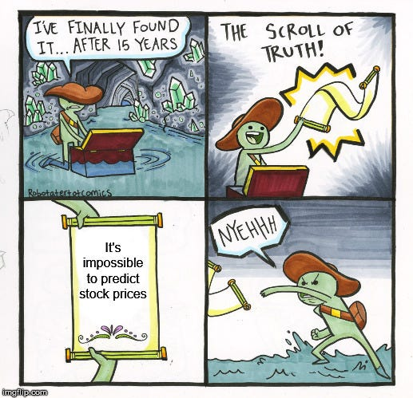

# Time series analysis in finance

#### -- Project Status: [ongoing]

## Project Intro/Objective
TODO

### TODO
TODO

### Contributing Members
* Daniel Wullschleger
* Ansam Zedan

### Methods Used //TODO
* Machine Learning
* Data Visualization
* Predictive Modeling

### Technologies //TODO
* R
* Shinnyapp
* ggplot2
* tidyr    
* forecast  
* tseries   
* lubridate
* corrplot
* tidyverse
* car
* randomForest
* lattice
* gridExtra
* rnaturalearth
* rnaturalearthdata
* grid
* patchwork
* corrr
* pastecs
